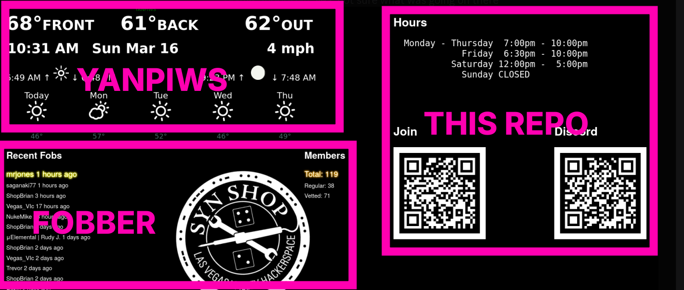

# dashboard-qr-codes

Static HTML to show QR codes, shop hours and iFrame weather on SYN Shop
front kiosk monitor.

The `index.html` has 3 iframes that  load:
* This repo's `hours-qr-codes.html` on the right
* An instance of [YANPIWS](https://github.com/mrjones-plip/YANPIWS) in the upper left
* An instance of [Fobber](https://github.com/mrjones-plip/fobber) in the lower left

